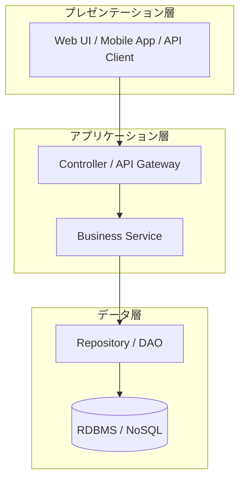

## 技術スタック

Java
Spring Boot
PostgreSQL

## 汎用3層アーキテクチャ構成図

```mermaid
flowchart TB
	subgraph L1[プレゼンテーション層]
		UI[Web UI / Mobile App / API Client]
	end

	subgraph L2[アプリケーション層]
		API[Controller / API Gateway]
		BIZ[Business Service]
	end

	subgraph L3[データ層]
		REPO[Repository / DAO]
		DB[(RDBMS / NoSQL)]
	end

	UI --> API
	API --> BIZ
	BIZ --> REPO
	REPO --> DB

```

### 各層の役割

1. プレゼンテーション層: 利用者や外部クライアントとの入出力を担当。
2. アプリケーション層: 業務ロジックとユースケースの実行を担当。
3. データ層: 永続化、データアクセス、外部システム連携を担当。